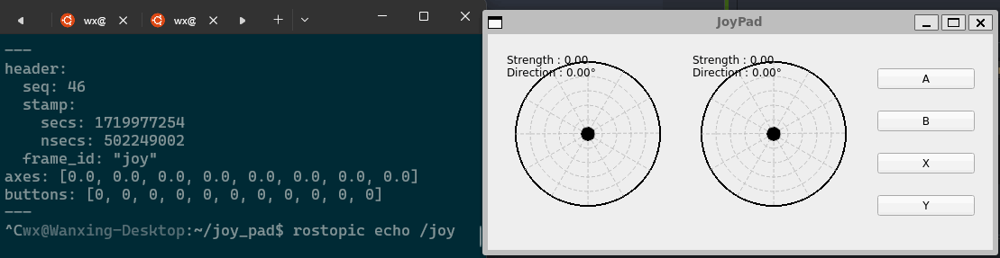

# Joy Pad

## Description

This is a simple joy pad that can be used to control a robot. For those who are using WSL or no joysticks environment, this is a good alternative to control your robot.



## Installation
1. Clone this repository
```bash
git clone https://github.com/Astrorix/joy_pad.git
```
2. Install the package
```bash
cd joy_pad
pip install ./
```

## Usage
> Note: You need to keep your ```roscore``` running before running the joy pad.

### To run the joy pad (in bash)
```bash
joy_pad
```
## Note

The message of joy pad sends the data to the topic ```/joy```. You can use this data to control your robot.


## /joy.axes and /joy.buttons Mapping

| Index | Axis name on the actual controller | Button name on the actual controller |
|---|---|---|
| 0 | Left/Right Axis stick left | A |
| 1 | Up/Down Axis stick left | B |
| 2 | Left/Right Axis stick right | X |
| 3 | Up/Down Axis stick right | Y |